# MyWay---------Travel Blog APP 
### App URL (Netlify): https://radiant-belekoy-ffd379.netlify.app/
- Frontend Github repo: https://github.com/Final-Project-CoderAcademy/Final-project/tree/main/frontend
### Backend API URL (Heroku): https://myway-backend.herokuapp.com/ For more please read the repo below
- Backend Github repo: https://github.com/Final-Project-CoderAcademy/Final-project/tree/main/backend
### Github repo: https://github.com/Final-Project-CoderAcademy/Final-project
## How to start the app in local side
Before start this app in local side, there are some scripts need to be introduced. When this repo is cloned to the local side, `yarn install` need to be run. This is used to run install the packages both in root path and frontend/ path. Then, some other scripts with the demonstration are shown below:  

- `yarn install:all` ----------run `yarn install` both in the folder of backend/ and frontend/

- `yarn start` ----------run the backend server.js 

- `yarn server` ----------run the backend server with nodemon 

- `yarn client` ----------only run the react app in frontend/ path 

***When you decide to run the script below, please make sure there is no useful information in the database.***  

- `yarn data:import` ----------clear the database and import some example data(you can check these data in backend/data)  

- `data:destroy` ----------destroy all the data in the database  

Test scripts:
- `yarn api:test` ----------to test great majority of the backend APIs with Jest

For frontend testing, please make sure run `yarn client` to start the frontend
- `yarn frontend:test` ----------to test frontend code with cypress

For more details, please read the scripts in package.json in different path

## Environment Variables  
- This app need environment variables, for more please contact with the authors.  

## Testing  

- Backend testing:  
  The Jest and supertest are used for backend testing. Here is the result of backend test. For more, please use `yarn api:test` in root path.  

Backend testing result screenshot

  

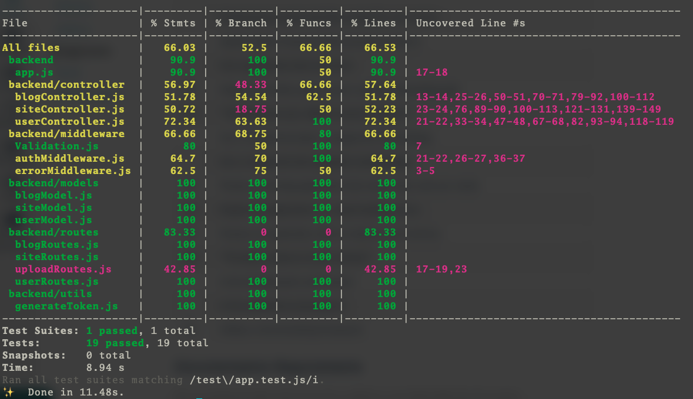   

  

## About Application
- **Purpose**  
The purpose of this application is to help travelers make the best of their trip. It provides travelers with the best places to do what they want to do, and allows them to share and reflect on their memories by sharing blogs. It also has the ability to search the weather of a destination from any screen without logging in, which is not found in other applications.

- **Target audience**  
The target audience is people who like to travel.

- **Tech stack**  
  This app is based on MERN stack. 
  On the front-end side, a dynamic HTML web interface is created by React. 
  The server-side development environment is Node.js, which enables the implementation of a JavaScript-based application backend. Express.js runs on Node.js and serves to simplify the processing of URL requests. MongoDB is the application's database, which manages data such as storing, updating, referencing, and deleting data in the application.

- **Functionality / features**  
  **a. For visitors without log in:**
  1. Visitors can create their own account and update their details including 'name', 'email' and 'password' anytime.
  2. Visitors can get information including map, descriptions and name of the sites recommended from the web app, but can't comment.
  3. Visitors can check the weather of each city in Australia in each page.  

  **b. For normal users already log in:**
  1. Users can get information including map, descriptions and name of the sites recommended from the web app and comment these recommendations.
  2. Users can post blogs and check all the blogs from themselves together in blogScreen. In addition, they can delete their blogs anytime. Each blog can be posted with one image.
  3. Users can comment other users' blogs.
  4. Users can check the weather of each city in Australia in each page.

  **c. For admin users:**
  1. Admin users have all the functions same as normal users.
  2. Admin users can manage the site recommendations, they can delete, create and update the information of site recommendations. 
  3. In addition, admin users can manage all the normal users. If admin users find some normal users post illegal information in their blogs, they are able to delete normal users. 
  4. Admin users are able to delete blogs as well.    

      
## Dataflow Diagram  

show image

  

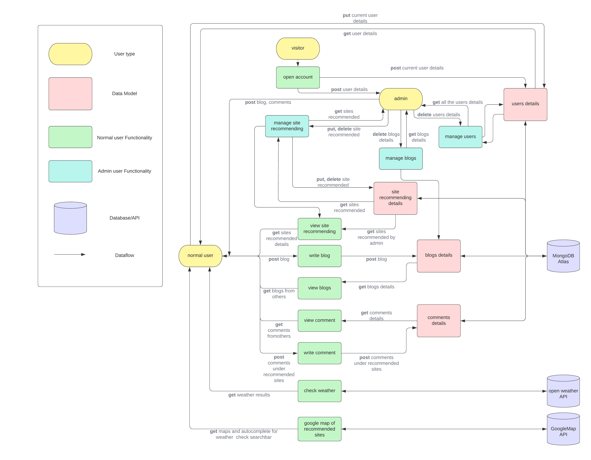   

  

  
---  

## Application Architecture Diagram

show image

  

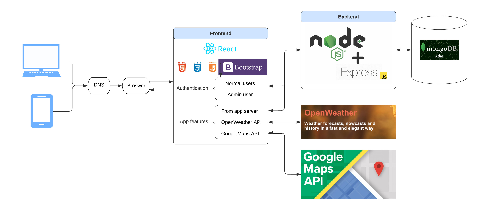    

 
   
---
  
## User Stories  
[Excel sheet for user story](https://onedrive.live.com/view.aspx?resid=6E0FC3D2BFB74104!129&ithint=file%2cxlsx&authkey=!AG1EELNirMpapYc)  
All the user stories are start as a traveler. We assume that if we are a traveler, what we want to get from this web app. Then, we assume that if we are the owner of this app, how can we manage it. Finally, we add a few more features we'd like to see as a normal user. Here are the screenshot of the process of completing the user stories. You also can find the final excel from the link above.

click for more

  

   
  
   

  

  

- As a traveler, I want to be able to securely log in, log out and change details of my account so my information only accessed for me.  
- As a traveller, I want to know about the application and what the feature of it so that I know if this app is appropriate for my situation.
- As a traveller, I want to see other travellers' photo so I can find more travling choices.  
- As a traveller, I want to see some recommendations from the app in different categories so I can find the place where I want to do something.
- As a traveler, I want to see the details of the recommended site so I can be sure it is the right place for me.
- As a traveller, I want to see other blog posts to see what I can do there before I travel.  
- As a traveller, I want to write a blog with a photo about my travel so it would be a memorable record.
- As a traveller, I want to comment on a blog article to ask something I want to know. 
- As a traveller, I want to check the weather of the place so I can make a plan easily. 
- As an admin of this web app, I want to control what sites should be recommended to the visitors so I can update them anytime.
- As an admin of this web app,  I want to be authorized to be able to delete blogs from common users so I can make sure all the blogs are legal and useful.
- As an admin of this web app, I want to be authorized to be able to delete common users so I can delete the user who posts a blog as an advertisement of illegal information.
- As an admin of this web app, I want to have the same features as a common user so I can do anything like them.

---  
  
## Wireframes   

show screenshots of wireframes

  

**Humburger menu for mobile**  
- When the user hasn't log in  
  

- When the user logged in  
  

- When the admin user logged in  
  

**Sign up form**   
- mobile  
  
 
- Tablet  
  

- Desktop  
  

**Log in form**  
- mobile  
  

- Tablet  
  

- Desktop  
  

**About Page(app top page)**  
- mobile   
  

  
- Tablet  
  

- Desktop  
  

**Site list Page**  
- mobile  
  

- Tablet  
  
 

- Desktop  
  

**Site Page**  
- mobile  
  

- Tablet  
  

- Desktop  
  

**Site create form**  
- mobile  
  

- Tablet  
  

- Desktop  
  
 

**Site update form**  
- mobile (Tablets and desktops are the same as the creation form except for the buttons, so the wireframes are mobile only.)  
  

**Blog list Page**  
- mobile  
  

- Tablet  
  

- Desktop  
  

**Blog article Page**  
- mobile  
  

- Tablet  
  

 
- Desktop  
  

**Blog create post form**  
- mobile  
  

- Tablet  
  
 

- Desktop  
  

 
**Blog update post form**  
- mobile (Tablets and desktops are the same as the creation form except for the buttons, so the wireframes are mobile only.)  
  
 

**My Home Page**   
- mobile  
  

- Tablet  
  

- Desktop  
  

**(For Admin) Site management Page**  
- mobile  
  

- Tablet  
  

- Desktop  
  

**(For Admin) User management Page**  
- mobile  
  

- Tablet  
  

- Desktop  
    

  

 

 ## Trello Board  
 [Trello Board link](https://trello.com/b/Uw6DU7pd/finalprojecta)  
Yuka Toshima worked primarily on wireframe, while Xinzhe Yu worked on Dataflow and Application Architecture Diagram. We started on October 24, and in Trello, we put the cards we were working on in the "Doing" section and moved them to the "Done" section when the work was finished to share our progress. The cards were marked with the due date and the person in charge so that we knew who was supposed to do what by when.

click for more

  
 - Day 1 (24th Oct)  
   **Start of the day**  
  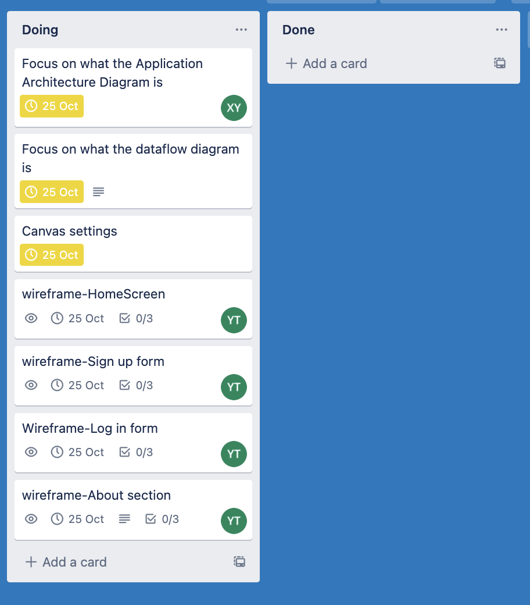  

   **End of the day**  
  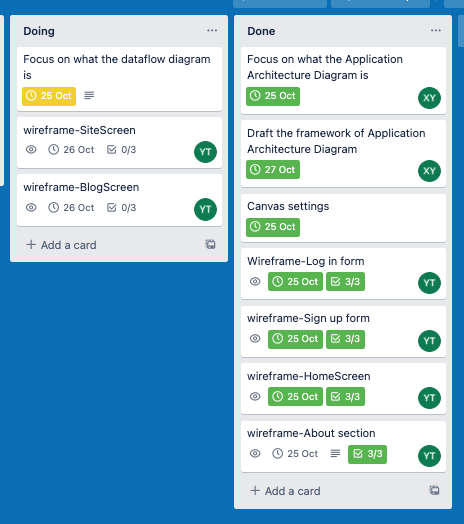  

- Day 2 (25th Oct)  
 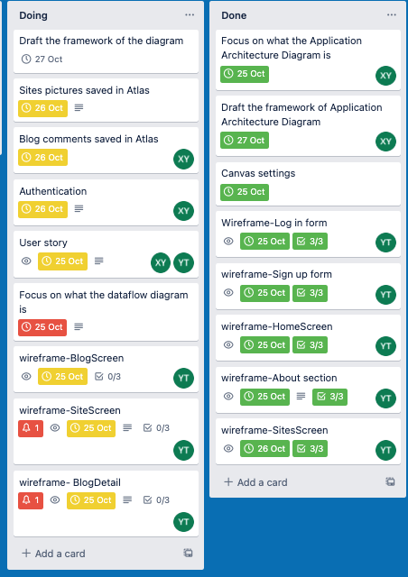   

- Day 3 (26th Oct)  
 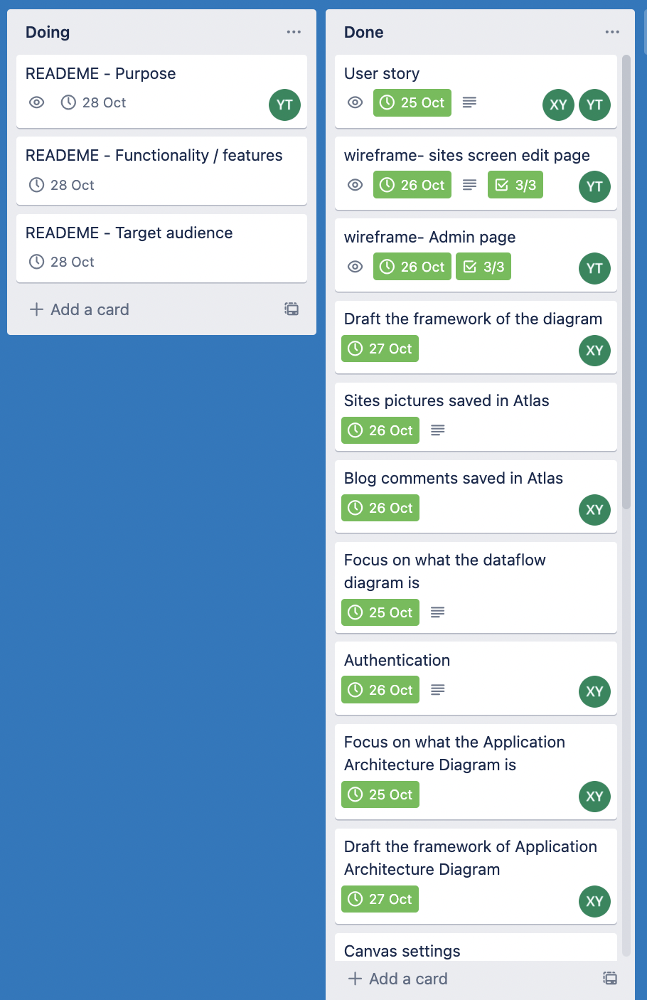   

- Day 4 (27th Oct)  
 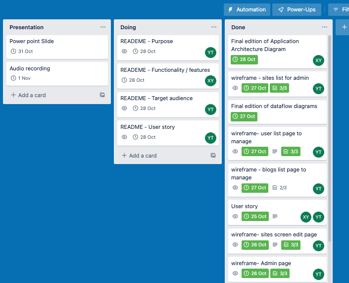   

- Day 5 (28th Oct)  
 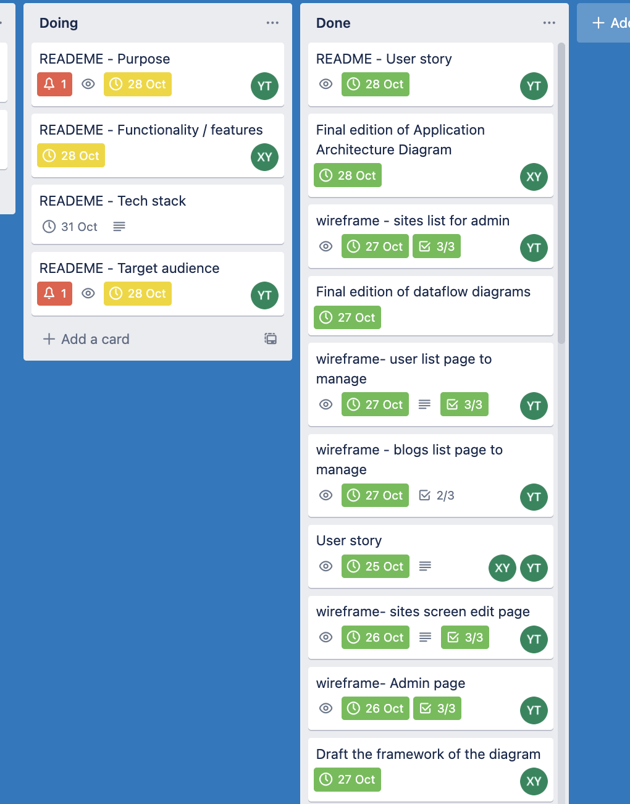   

- Day 6 (29th Oct)  
 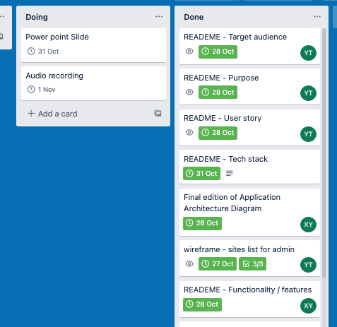   

- Last Day (1st Nov)  
 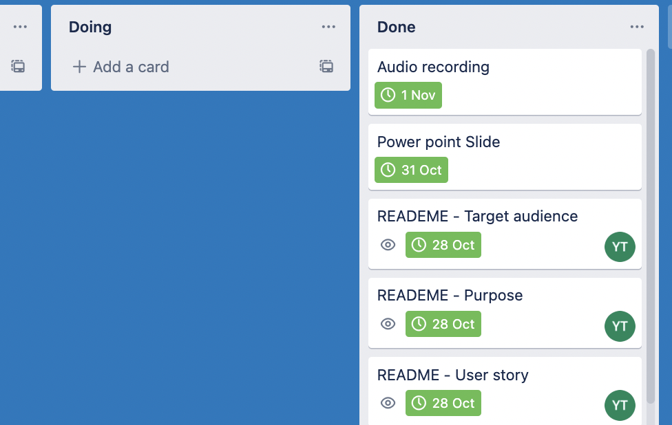   

  

