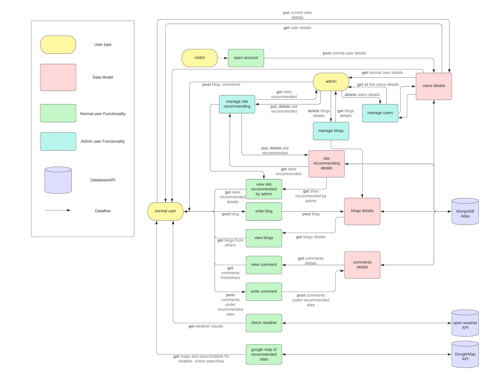

# MyWay
## About Application
- **Purpose**  

- **Tech stack**  
  This app is based on MERN stack. 
- **Functionality / features**  
  **a. For visitors without log in:**
  1. Visitors can create their own account and update their details including 'name', 'email' and 'password' anytime.
  2. Visitors can get information including map, descriptions and name of the sites recommended from the web app, but can't comment.
  3. Visitors can check the weather of each city in Australia in each page.  

  **b. For normal users already log in:**
  1. Users can get information including map, descriptions and name of the sites recommended from the web app and comment these recommendations.
  2. Users can post blogs and check all the blogs from themselves together in blogScreen. In addition, they can delete their blogs anytime. Each blog can be posted with one image.
  3. Users can comment other users' blogs.
  4. Users can check the weather of each city in Australia in each page.

  **c. For admin users:**
  1. Admin users have all the functions same as normal users.
  2. Admin users can manage the site recommendations, they can delete, create and update the information of site recommendations. 
  3. In addition, admin users can manage all the normal users. If admin users find some normal users post illegal information in their blogs, they are able to delete normal users. 
  4. Admin users are able to delete blogs as well.
- **Target audience**

## Dataflow Diagram
  
  
## Application Architecture Diagram
  
  
## User Stories  
[Excel sheet for user story](https://onedrive.live.com/view.aspx?resid=6E0FC3D2BFB74104!129&ithint=file%2cxlsx&authkey=!AG1EELNirMpapYc)  
All the user stories are start as a traveler. We assume that if we are a traveler, what we want to get from this web app. Then, we assume that if we are the owner of this app, how can we manage it. Finally, we add a few more features we'd like to see as a normal user. Here are the screenshot of the process of completing the user stories. You also can find the final excel from the link above.
   
  
   

 
- As a traveler, I want to be able to securely log in, log out and change details of my account so my information only accessed for me.  
- As a traveller, I want to know about the application and what the feature of it so that I know if this app is appropriate for my situation.
- As a traveller, I want to see other travellers' photo so I can find more travling choices.  
- As a traveller, I want to see some recommendations from the app in different categories so I can find the place where I want to do something.
- As a traveler, I want to see the details of the recommended site so I can be sure it is the right place for me.
- As a traveller, I want to see other blog posts to see what I can do there before I travel.  
- As a traveller, I want to write a blog with a photo about my travel so it would be a memorable record.
- As a traveller, I want to comment on a blog article to ask something I want to know. 
- As a traveller, I want to check the weather of the place so I can make a plan easily. 
- As an admin of this web app, I want to control what sites should be recommended to the visitors so I can update them anytime.
- As an admin of this web app,  I want to be authorized to be able to delete blogs from common users so I can make sure all the blogs are legal and useful.
- As an admin of this web app, I want to be authorized to be able to delete common users so I can delete the user who posts a blog as an advertisement of illegal information.
- As an admin of this web app, I want to have the same features as a common user so I can do anything like them.

## Wireframes  
**Humburger menu for movile**  
- When the user hasn't log in    
%20.jpg) 

- When the user logged in  
.png)  

- When the admin user logged in  
.jpg)

**Sign up form**   
- movile  
   
 
- Tablet    
   

- Desktop    
  

**Log in form**  
- movile   
   

- Tablet   
  

- Desktop  
  

**Top Page**  
- movile   
   
  
- Tablet   
   
 
- Desktop  
  

**Site list Page**  
- movile   
   

- Tablet  
  

- Desktop   
  
 

**Site Page**  
- movile  
   

- Tablet   
   

- Desktop   
   

**Site create form**  
- movile   
  

- Tablet  
  

- Desktop   
  

**Site update form**   
- movile (Tablets and desktops are the same as the creation form except for the buttons, so the wireframes are mobile only.)  
   

**Blog list Page**   
- movile   
  

- Tablet  
   

- Desktop   
  

**Blog article Page**  
- movile  
   

- Tablet  
  
 
- Desktop  
  

**Blog create post form**   
- movile   
   

- Tablet   
  

- Desktop  
  

 
**Blog update post form**  
- movile (Tablets and desktops are the same as the creation form except for the buttons, so the wireframes are mobile only.)  
   

**My Home Page**   
- movile   
  

- Tablet  
  

- Desktop  
  

**(For Admin) Site management Page**  
- movile   
.jpg)  

- Tablet   
.jpg)  

- Desktop  
.jpg)  

**(For Admin) User management Page**   
- movile   
.jpg)  

- Tablet  
.jpg)   

- Desktop   
.jpg)  
 

 ## Trello Board  
 [Trello Board link](https://trello.com/b/Uw6DU7pd/finalprojecta)